# OOSD-Project

Integrated Drones Services
This project consists of 3 users such as 
1)	Manager user can create, update and delete drones details & can raise issues request
2)	Admin user review issues & assign to operators
3)	operators will see assigned issues and then resolve issues
To run this project we need to install MYSQL, TOMCAT, JAVA and ECLIPSE. Create dataset in MYQL by copying content from ‘db.txt’ file and then paste in MYSQL console to create database
Import project and run in eclipse to get below output screen
SCREEN SHOTS
 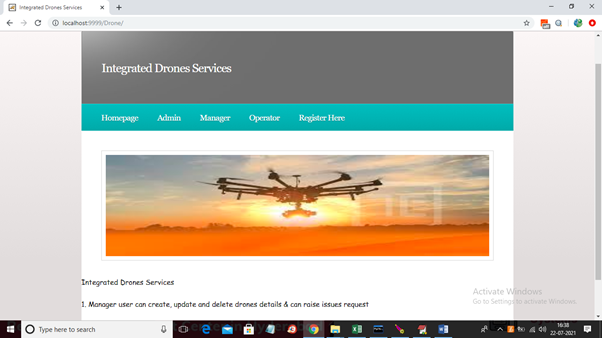
In above screen click on ‘Register Here’ link to get below registration form
 
In above screen ‘Manager’ is registering and then click on ‘Register’ button to get below result
 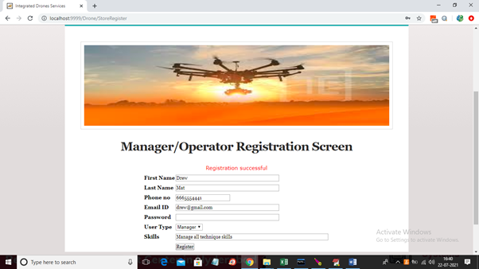
In above screen manager registration successful and similarly add operator user by selecting user type as ‘Operator’
 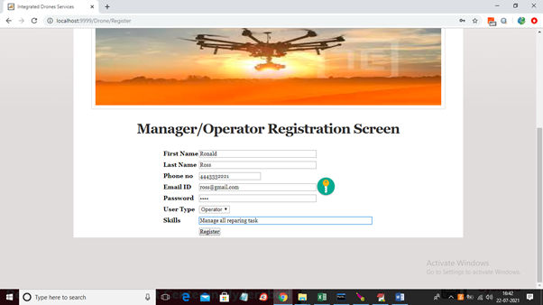
In above screen ‘Operator’ is registering and then click on ‘Register’ button to get below screen
 
In above screen operator registration successful and now click on ‘Manager’ link to login as manager
 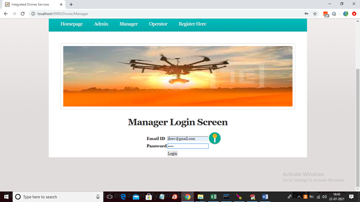
In above screen ‘Manager’ user is login and after login will get below screen
 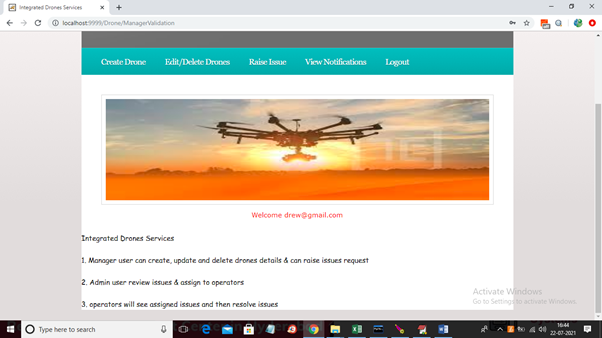
In above screen manager can click on ‘Create Drone’ to add drone details
 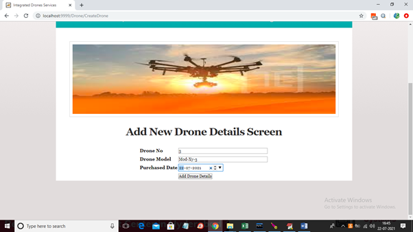
In above screen manager will enter drone no, model and purchase date and then click on ‘Add Drone Details’ button to add drone details
 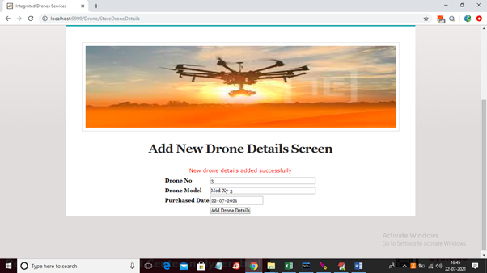
In above screen new drone detail added and now click on ‘Edit/Delete Drones’ link to view all drone details
 
In above screen manager can view all drone details and can click on ‘Delete’ link to delete any drone details
 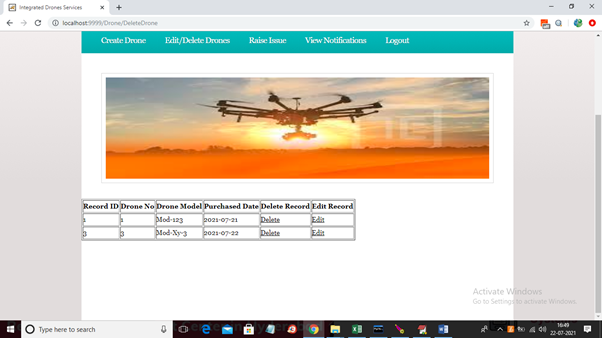
In above screen ‘drone 1’ details deleted and now click on ‘Edit’ link to edit drone details
 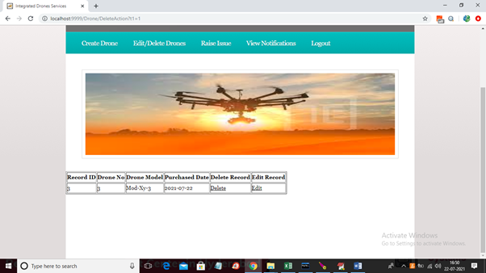
In above screen change any details and click ‘Edit Drone details’ button to edit details
 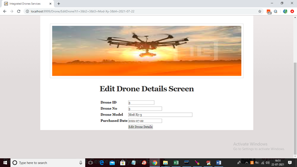
In above screen I changed drone model name and now click on ‘Raise Issue’ link to get below screen
 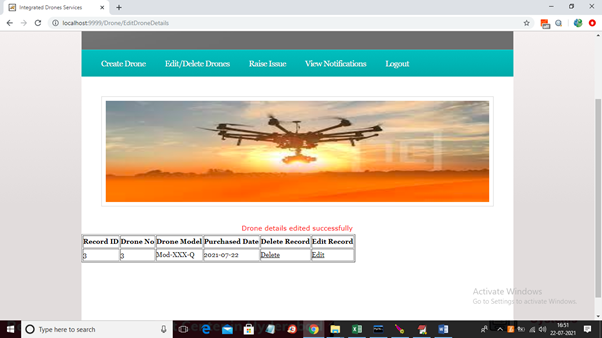
In above screen manager can click on ‘Click Here’ link to raise issue and to get below screen
 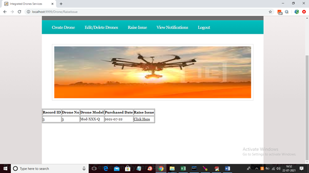
In above screen drone details and manager name and phone number will populate from drop down box and then enter issue summary/description and then click on ‘Submit’ button to raise issue and this issue will report to admin
 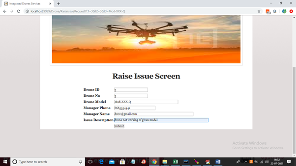
In above screen drone issue details successfully submitted and now logout and login as ‘admin’ to view issue and to assign to operators
 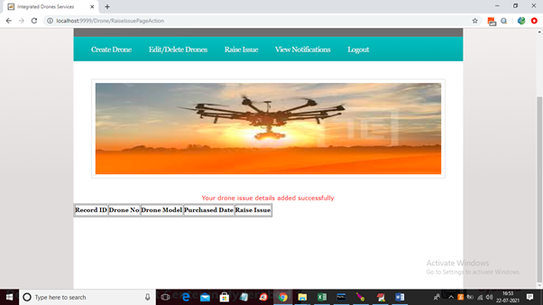
In above screen ‘admin’ is login and after login will get below screen
 
In above screen admin can click on ‘View Raise Tickets’ link to view issues from manager
 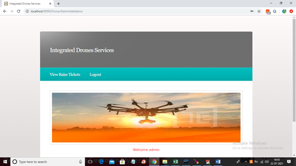
In above screen admin can see all issue details and the status is also pending which means not yet assigned to operator so admin has to click on ‘Assign Operator’ link to get below screen
 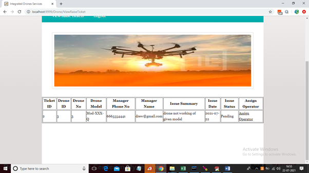
In above screen we can see ticket id by default and then admin will select desire operator from drop down list and then click on ‘Submit’ button to assign that ticket to operator
 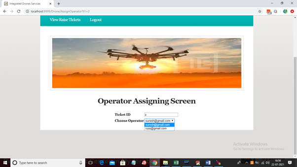
In above screen we can see ticket assigned to ross operator and now logout and login as ‘Operator’ to view issue and then solve it
 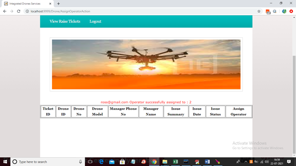
In above screen operator is login and after login will get below screen
 
In above screen operator can click on ‘View Assigned Issues’ link to view assigned issues
 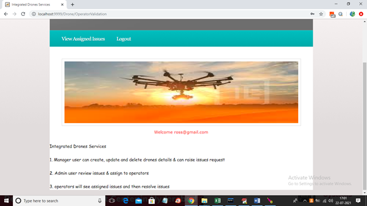
In above screen operator can see all issues assigned to him and then he will solve issues and then click on ‘Solve Issue’ link to solve the issue and notification will send to manager
 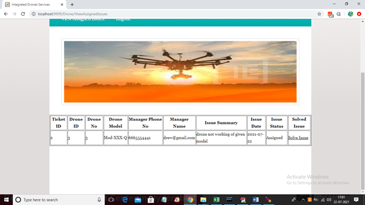
In above screen we can see once issued solved then it will remove from above assigned list and now logout and login as manager to view issue status
 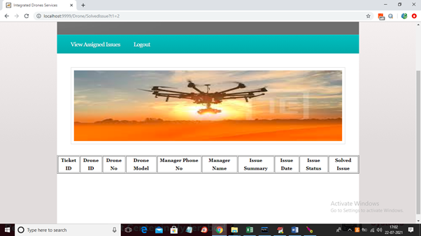
In above screen manager is login and after login will get below screen
 
In above screen manager can click on ‘View Notification’ link to get all solved issues from operator
 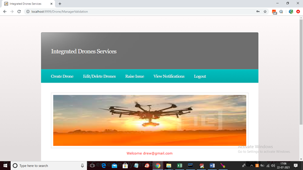
In above screen manager can see status of issue as ‘Solved Issue’ and in below screen we can see if user left any field blank then will get below validation
 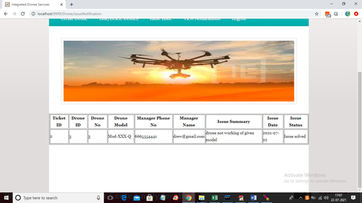
In above screen we can see validation report sent by server if fields are blank
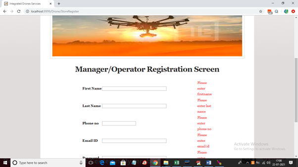

